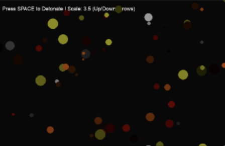

# 💥 Pookie's Hyper-Realistic Explosion Simulator

Welcome to the **Explosion Simulator**, a high-performance Python-based particle engine built with `Pygame`. This simulator uses physics-based velocity, friction, and color-decay algorithms to mimic the expansion of thermal energy.



## 🚀 Features
* **Dynamic Scaling:** Adjust the magnitude of the blast in real-time.
* **Physics Engine:** Includes air resistance (drag) and particle dissipation.
* **Thermal Gradients:** Particles transition from white-hot to deep ember as they lose energy.
* **High Performance:** Capable of handling hundreds of particles simultaneously using Python vectors.

## 🛠️ Installation

1.  **Install Python:** Ensure you have Python 3.x installed.
2.  **Install Pygame:** Open your terminal or Thonny's package manager and run:
    ```bash
    pip install pygame
    ```
3.  **Run the Sim:**
    ```bash
    python explosion_sim.py
    ```

## 🎮 Controls
| Key | Action |
| :--- | :--- |
| **SPACE** | Trigger Detonation |
| **UP ARROW** | Increase Explosion Scale (Max 20.0) |
| **DOWN ARROW** | Decrease Explosion Scale (Min 1.0) |
| **ESC / Close**| Exit Simulator |

## 🧪 The Math Behind the Boom
The simulation utilizes a friction coefficient ($\mu = 0.95$) applied to the velocity vectors $\vec{v}$ every frame to simulate air resistance:

$$v_{next} = v_{current} \times 0.95$$

The particle radius also decreases linearly as the "heat" (life) of the particle reaches zero, simulating the cooling and dispersion of smoke.

---
*Created with love for pookie bear.*
